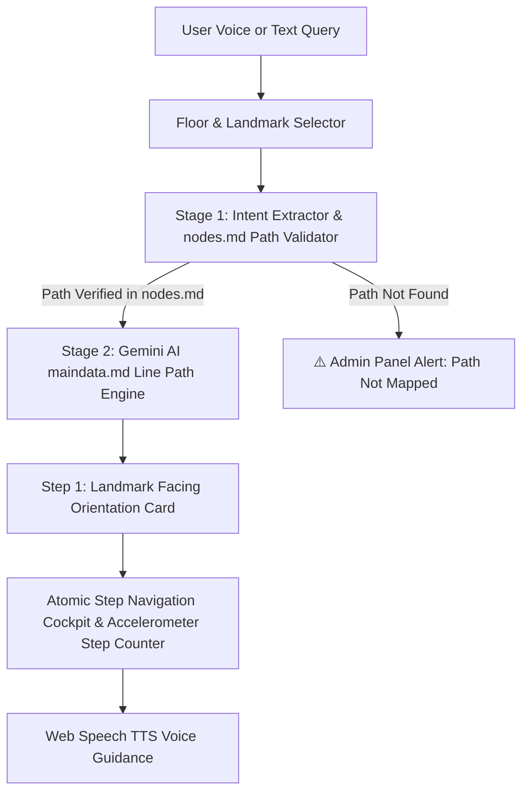

# 🧭 Smart Campus Navigation System

> **An LLM-Powered, Voice-First Indoor Navigator That Talks Users From Where They Stand to Where They Need to Be.**

---

## 📱 Mobile-First Live Experience & QR Code

> [!IMPORTANT]
> **Mobile Optimized Tool**: This web application is specially designed for mobile phone usage! Open the link on your smartphone or scan the QR code below for the best voice-first navigation cockpit experience.

### 🌐 Live Web Application URL
👉 **[https://deepesh-45.github.io/college-navigation-system/](https://deepesh-45.github.io/college-navigation-system/)**

### 📲 Scan QR Code to Open on Mobile Device:


---

## 📌 Table of Contents
1. [Project Problem](#1-project-problem)
2. [Existing Solutions & Limitations](#2-existing-solutions--limitations)
3. [Our Idea & Solution](#3-our-idea--solution)
4. [System Workflow & Architecture](#4-system-workflow--architecture)
5. [MVP Features + USP](#5-mvp-features--usp)
6. [Business Model](#6-business-model)
7. [Long-Term Goals + Feasibility](#7-long-term-goals--feasibility)
8. [Team & Acknowledgments](#8-team--acknowledgments)

---

## 1. Project Problem

Indoor wayfinding across multi-building academic complexes presents fundamental navigation challenges for new students, visitors, and campus staff.

* 🚫 **Indoor GPS Signal Loss**: Satellite GPS signals fail to penetrate concrete walls, metal structures, and multi-story academic blocks.
* 🗺️ **Complex Sprawling Layouts**: Multi-floor layouts with similar-looking hallways make manual orientation difficult.
* ♿ **Accessibility Barriers**: Visually impaired or mobility-challenged individuals struggle to navigate using static 2D map blueprints while walking.
* 💸 **Infrastructure Dependency**: Traditional indoor positioning systems require installing and maintaining dedicated hardware across every floor.

---

## 2. Existing Solutions & Limitations

Current market options rely heavily on physical hardware infrastructure and manual spatial tagging:

| Solution | Mechanism | Factual Limitations |
| :--- | :--- | :--- |
| **BLE Beacons (e.g., MapXus, MazeMap)** | Bluetooth beacons mounted on walls and ceilings every few meters. | Dedicated hardware purchasing, periodic battery replacements, physical installation overhead. |
| **Wi-Fi Fingerprinting / RTT** | Signal strength triangulation across router networks. | Signal noise from walls/people, drift errors, network infrastructure dependency. |
| **Static Entrance Kiosks** | Fixed touchscreen displays installed at building lobbies. | Stationary location, non-portable, zero walking turn-by-turn guidance. |

---

## 3. Our Idea & Solution

**"A Voice Conversation Replaces Complex Maps."**

We built a **hardware-free, voice-first indoor navigation system** powered by Gemini AI and structured Markdown data. Users speak or type where they want to go, and receive step-by-step spoken instructions anchored to physical floor landmarks.

### Key Factual Pillars of Our Solution:
1. 📍 **Landmark Anchors (`landmarks.json`)**: Navigation begins from verified floor anchor landmarks (*"Main Entrance"* on Ground Floor, *"Stair Landing"* on First Floor).
2. 🧭 **Facing Orientation Guidance**: Step 1 instructs initial body orientation before walking (*"Face towards the wall at the end of the staircase"*).
3. 👣 **Atomic Step Guidance**: Path text is decomposed into single, unambiguous action steps (*"Turn right"*, *"Move straight 28 steps"*, *"Destination reached"*).
4. 📄 **Single Source of Truth (`maindata.md`)**: All landmark routes are stored in a clean markdown database, editable in real time via the Admin Portal.

---

## 4. System Workflow & Architecture

Our system uses a **Two-Stage Dedicated Gemini AI Prompt Pipeline**:



### Stage 1: Intent Extraction & `nodes.md` Path Validation
- Uses `buildGeminiDestinationExtractorAndValidatorPrompt` to parse natural language queries (e.g., *"where is washroom"*, *"take me to f05"*, *"ds lab"*).
- Matches intent against [`src/data/nodes.md`](file:///Users/deepeshpatel/college-navigation-system/src/data/nodes.md) to verify path existence.

### Stage 2: 100% Line-Faithful Step Generator (`maindata.md`)
- Uses `buildGeminiNavigationSystemPrompt` to locate the exact matching line in [`src/data/maindata.md`](file:///Users/deepeshpatel/college-navigation-system/src/data/maindata.md).
- Constructs atomic steps 100% faithfully from that exact line without synthetic route generation or hallucinated paths.

---

## 5. MVP Features + USP

### 🌟 MVP Core Features
* 🏢 **Floor & Landmark Selector**: Ground Floor (*Main Entrance*) & First Floor (*Stair Landing*) selection.
* 🗣️ **Voice & Text Input**: Web Speech API integration for speech-to-text input and free-text search.
* 🧭 **Initial Facing Orientation Card**: Amber instruction banner and spoken prompt before Step 1 starts.
* 👣 **Live Footstep Counter & Cockpit**: Device accelerometer sensor integration for step counting and haptic feedback.
* 🛠️ **Admin Live Markdown Editor**: Real-time `maindata.md` live website editor and route appender.

### 💎 Factual Unique Selling Proposition (USP)
* 🚀 **Zero Hardware Infrastructure**: Operates purely through software without wall beacons or extra sensors.
* 🔒 **100% Line-Faithful Execution**: Powered strictly by `maindata.md` route definitions.
* 🧠 **Flexible Intent & Numeric Matching**: Resolves synonyms and numeric formats (`"washroom"` ➔ `"Boys/Girls Washroom"`, `"f-05"` ➔ `"Room F-05"`).
* ⚡ **Zero Route Caching**: Parses fresh markdown data on every query to ensure live metadata sync.

---

## 6. Business Model

Our solution follows a **B2B SaaS Freemium Model** targeted at educational institutions, hospitals, and commercial complexes:

```text
 ┌─────────────────────────────────────────────────────────────────────────────────┐
 │ 1. ENTERPRISE CAMPUS LICENSE                                                   │
 │ • Software licensing for university blocks, hospitals, and commercial venues.  │
 ├─────────────────────────────────────────────────────────────────────────────────┤
 │ 2. ADMIN ROUTE PORTAL & METADATA MANAGEMENT                                     │
 │ • Web portal for campus administrators to manage landmark paths in maindata.md.│
 ├─────────────────────────────────────────────────────────────────────────────────┤
 │ 3. WHITE-LABEL STUDENT APP SDK                                                 │
 │ • Embed the voice navigation cockpit into existing official student mobile apps.│
 └─────────────────────────────────────────────────────────────────────────────────┘
```

---

## 7. Long-Term Goals + Feasibility

### 🚀 Strategic Growth Roadmap

```text
  Level 1 (Current MVP)       Level 2 (Complete Navigation)    Level 3 (Offline LLM & WebXR AR)
 ┌──────────────────────┐    ┌─────────────────────────────┐  ┌────────────────────────────────┐
 │ Ground & First Floor │ ➔  │ Multi-Building Cross-Floor  │ ➔│ Offline Local WebAssembly LLM  │
 │ Landmark Path Engine │    │ Landmark Graph Network      │  │ & WebXR Camera AR Overlays     │
 └──────────────────────┘    └─────────────────────────────┘  └────────────────────────────────┘
```

* **Level 1 — Current MVP**: Landmark navigation engine, facing orientation anchors, and live `maindata.md` Admin Portal editor.
* **Level 2 — Complete Campus Navigation**: Multi-building cross-floor landmark graph mapping and white-label SDK integration.
* **Level 3 — Offline Local LLM & WebXR AR**: Local WebAssembly LLMs (e.g. Ollama / Llama-3-Nano) for internet-free basement navigation + WebXR camera AR overlays.

---

## 8. Team & Acknowledgments

### 👥 Team Members:
* **Deepesh Patel** (Lead Developer)
* **Jatin Karma**
* **Anushka Dubey**
* **Divya Verma**

Thank you for exploring the **Smart Campus Navigation System**!

* 🌐 **Live Web App**: [https://deepesh-45.github.io/college-navigation-system/](https://deepesh-45.github.io/college-navigation-system/)
* 📂 **GitHub Repository**: [https://github.com/deepesh-45/college-navigation-system](https://github.com/deepesh-45/college-navigation-system)