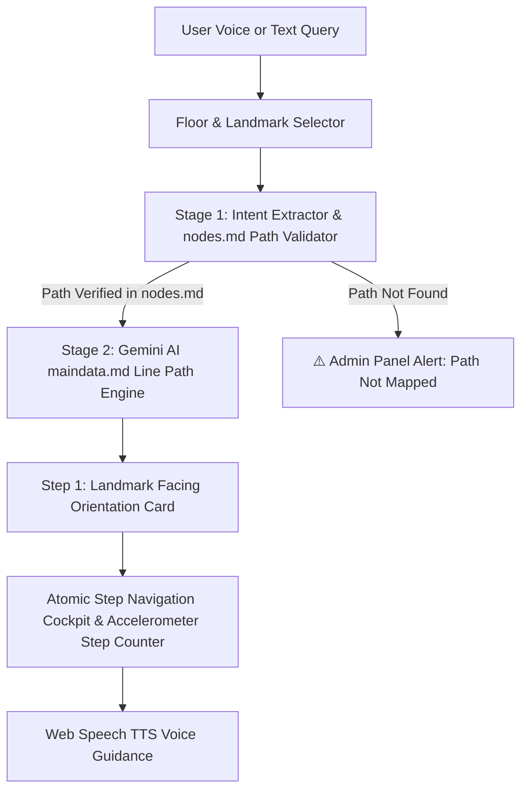

# 🧭 Smart Campus Navigation System

> **An LLM-Powered, Voice-First Indoor Navigator That Talks Users From Where They Stand to Where They Need to Be.**

---

## 📱 Mobile-First Live Experience & QR Code

> [!IMPORTANT]
> **Mobile Optimized Tool**: This web application is specially designed for mobile phone usage! Open the link on your smartphone or scan the QR code below for the best voice-first navigation cockpit experience.

### 🌐 Live Web Application URL
👉 **[https://deepesh-45.github.io/college-navigation-system/](https://deepesh-45.github.io/college-navigation-system/)**

### 📲 Scan QR Code to Open on Mobile Device:


---

## 📌 Table of Contents
1. [Project Problem](#1-project-problem)
2. [Existing Solutions & Limitations](#2-existing-solutions--limitations)
3. [Our Idea & Solution](#3-our-idea--solution)
4. [System Workflow & Architecture](#4-system-workflow--architecture)
5. [MVP Features + USP](#5-mvp-features--usp)
6. [Business Model](#6-business-model)
7. [Long-Term Goals + Feasibility](#7-long-term-goals--feasibility)
8. [Thank You](#8-thank-you)

---

## 1. Project Problem

Indoor wayfinding across large multi-building university campuses is broken and stressful for students, visitors, and faculty.

* 🚫 **No Indoor GPS Signal**: Satellite GPS signals fail to penetrate concrete walls and multi-story academic blocks.
* 🗺️ **Complex Sprawling Layouts**: **68% of first-year students** report getting lost during their first month on campus.
* ♿ **Accessibility Barriers**: Visually impaired or mobility-challenged users struggle to interpret traditional flat 2D maps.
* 💸 **Exorbitant Hardware Costs**: Traditional indoor positioning systems cost thousands of dollars per building to install and maintain.

---

## 2. Existing Solutions & Limitations

Current market options rely heavily on hardware infrastructure and manual mapping:

| Existing Solution | How It Works | Major Limitations |
| :--- | :--- | :--- |
| **BLE Beacons (e.g., MapXus, MazeMap)** | Mounted Bluetooth beacons every 10–15 meters on walls/ceilings. | **High Hardware Cost ($8,500+/building)**, severe battery maintenance, wall damage. |
| **Wi-Fi RTT / Fingerprinting** | Triangulates position using router signal strength. | High signal noise, drift errors, requires expensive network upgrades. |
| **Static 2D Touch Kiosks** | Physical kiosks placed at building entrances. | Fixed location, non-portable, zero step-by-step guidance while walking. |

---

## 3. Our Idea & Solution

**"A Voice Conversation Replaces Complex Maps."**

We built a **hardware-free, voice-first indoor navigation system** powered by Gemini AI and structured Markdown data. Instead of looking at confusing 2D blueprints while walking, users simply speak or type where they want to go, and receive personalized turn-by-turn spoken guidance.

### Key Pillars of Our Idea:
1. 📍 **Landmark Anchors (`landmarks.json`)**: Navigation starts by anchoring to physical floor landmarks (*"Main Entrance"* on Ground Floor, *"Stair Landing"* on First Floor).
2. 🧭 **Facing Orientation Guidance**: Step 1 instructs the user how to stand before walking (*"Face towards the wall at the end of the staircase"*).
3. 👣 **Atomic Step Guidance**: Paths are decomposed into simple, single-work atomic actions (*"Turn right"*, *"Move straight 28 steps"*, *"Destination reached"*).
4. 📄 **Single Source of Truth (`maindata.md`)**: All landmark routes are defined in a clean markdown file, editable in real-time via the Admin Portal.

---

## 4. System Workflow & Architecture

Our system uses a **Two-Stage Dedicated Gemini AI Prompt Pipeline**:



### Stage 1: Intent Extraction & `nodes.md` Path Validation
- Uses `buildGeminiDestinationExtractorAndValidatorPrompt` to parse natural language queries (e.g., *"where is washroom"*, *"take me to f05"*, *"ds lab"*).
- Matches intent against [`src/data/nodes/nodes.md`](file:///Users/deepeshpatel/college-navigation-system/src/data/nodes/nodes.md) to confirm path existence.

### Stage 2: 100% Line-Faithful Step Generator (`maindata.md`)
- Uses `buildGeminiNavigationSystemPrompt` to locate the exact matching line in [`src/data/maindata.md`](file:///Users/deepeshpatel/college-navigation-system/src/data/maindata.md).
- Constructs atomic steps 100% faithfully from that exact line without hallucination or fake fallbacks.

---

## 5. MVP Features + USP

### 🌟 MVP Core Features
* 🏢 **Floor & Landmark Selection**: Ground Floor (*Main Entrance*) & First Floor (*Stair Landing*) selection.
* 🗣️ **Voice & Type Input**: Integrated browser Web Speech STT and free-text search.
* 🧭 **Initial Facing Orientation Card**: Visual amber instruction banner and spoken orientation prompt before Step 1 starts.
* 👣 **Live Footstep Counter & Compass Cockpit**: Real-time sensor integration via device accelerometer and haptic feedback.
* 🛠️ **Admin Live Markdown Editor**: Admin Panel to add, edit, and save routes directly to `maindata.md` at runtime.

### 💎 Unique Selling Proposition (USP)
* 🚀 **Zero Hardware Infrastructure ($0 Setup Cost)**: No BLE beacons, no extra sensors, no hardware maintenance.
* 🔒 **100% Deterministic & Reliable**: Powered strictly by `maindata.md` with zero synthetic route hallucinations.
* 🧠 **Flexible Intent & Numeric Matching**: Automatically resolves synonyms (`"washroom"` ➔ `"Boys/Girls Washroom"`, `"f-05"` ➔ `"Room F-05"`).
* ⚡ **Zero Route Caching**: Every search parses fresh markdown data to guarantee live metadata sync.

---

## 6. Business Model

Our solution follows a **B2B SaaS Freemium Model** targeted at educational institutions and commercial indoor spaces:

```text
 ┌─────────────────────────────────────────────────────────────────────────────────┐
 │ 1. ENTERPRISE CAMPUS LICENSE (Subscription)                                    │
 │ • Annual software licensing per university block, hospital, or mall.           │
 ├─────────────────────────────────────────────────────────────────────────────────┤
 │ 2. ADMIN ROUTE MANAGER & ANALYTICS DASHBOARD                                   │
 │ • Web portal for campus admins to manage landmark paths and view foot-traffic. │
 ├─────────────────────────────────────────────────────────────────────────────────┤
 │ 3. WHITE-LABEL STUDENT APP SDK                                                 │
 │ • Embed our voice navigation cockpit into existing official college mobile apps.│
 └─────────────────────────────────────────────────────────────────────────────────┘
```

---

## 7. Long-Term Goals + Feasibility

### 🚀 Roadmap & Scale

```text
  Phase 1 (Current MVP)       Phase 2 (Q3)               Phase 3 (Q4)               Phase 4 (Year 2)
 ┌─────────────────────┐    ┌─────────────────────┐    ┌─────────────────────┐    ┌─────────────────────┐
 │ Landmark Navigation │ ➔  │ Offline Local LLM   │ ➔  │ WebXR AR Camera     │ ➔  │ Universal Indoor    │
 │ Engine & maindata.md│    │ (Ollama / Llama-3)  │    │ Wayfinding Overlays │    │ SDK (Airports/Malls)│
 └─────────────────────┘    └─────────────────────┘    └─────────────────────┘    └─────────────────────┘
```

* **Offline Capabilities**: Integrating local WebAssembly LLMs (Ollama / Llama-3-Nano) for 100% offline navigation in underground basements.
* **WebXR Augmented Reality**: Adding camera AR arrows over physical hallways for visual direction overlay.
* **Universal indoor SDK**: Expanding beyond academic blocks to shopping malls, airports, and healthcare facilities.

---

## 8. Thank You

Thank you for exploring the **Smart Campus Navigation System**!

* 🌐 **Live Web App**: [https://deepesh-45.github.io/college-navigation-system/](https://deepesh-45.github.io/college-navigation-system/)
* 📂 **GitHub Repository**: [https://github.com/deepesh-45/college-navigation-system](https://github.com/deepesh-45/college-navigation-system)
* 📬 **Contact**: Deepesh Patel — Lead Developer